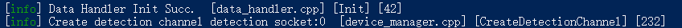

# 1 Introduction

Livox SDK2 is the software development kit designed for all Livox products. It is developed based on C/C++ following Livox SDK2 Communication Protocol, and provides easy-to-use C style API. With Livox SDK2, users can quickly connect to Livox products and receive point cloud data. 

Livox SDK2 consists of Livox SDK2 communication protocol, Livox SDK2 core, Livox SDK2 API(livox_lidar_sdk.h), Linux sample(livox_lidar_quick_start)

## Prerequisites
* x86
  * Ubuntu 20.04 /Ubuntu 18.04/Ubuntu 16.04

* ARM (Nvidia TX2) 
  * Ubuntu 18.04

* Windows 10, Visual Studio 2019
* C++11 compiler 


# 2 Livox SDK2 API

Livox SDK2 API provides a set of C style functions which can be conveniently integrated in C/C++ programs, Please refer to sdk_core\include\livox_lidar_sdk.h<br>

Livox SDK communication protocol opens to all users. It is the communication protocol between user programs and livox product.The protocol consists of control commands and data format, please refer to the below documents for each product:<br>
**HAP(TX/T1)**: 

​    [HAP SDK protocol](<https://github.com/Livox-SDK/Livox-SDK2/wiki/Livox-SDK-Communication-Protocol-HAP>)(中文)

​    [HAP SDK protocol](<https://github.com/Livox-SDK/Livox-SDK2/wiki/Livox-SDK-Communication-Protocol-HAP(English)>)(English)


## 2.1 Installation
The installation procedures in Ubuntu 20.04 /Ubuntu 18.04/Ubuntu 16.04 LTS and Windows 10 are shown here as examples. 
### 2.1.1 Ubuntu 20.04/18.04/16.04 LTS
#### Dependencies
Livox SDK2 requires [CMake 3.0.0+](https://cmake.org/) as dependencies. You can install these packages using apt:  
```
sudo apt install cmake
```
#### Compile Livox SDK2

In the Livox SDK2 directory, run the following commands to compile the project: 
```
git clone https://github.com/Livox-SDK/Livox-SDK2.git
cd ./Livox-SDK2/
mkdir build
cd build
cmake .. && make -j
sudo make install
```

### 2.1.2 Windows 10

#### Dependencies
Livox SDK2 supports Visual Studio 2019 and requires install [CMake 3.0.0+](https://cmake.org/) as dependencies.  

In the Livox SDK2 directory, run the following commands to create the Visual Studio solution file. 

For Viusal Studio 2019:

```
cd Livox-SDK2/build
```
Generate the 32-bit project:

```
cmake .. -G "Visual Studio 16 2019" -A Win32
```
Generate the 64-bit project:
```
cmake .. -G "Visual Studio 16 2019" -A x64
```

#### Compile Livox SDK2
You can now compile the Livox SDK2 in Visual Studio.

### 2.1.3 ARM-Linux Compile

The procedure of compile Livox-SDK2 in ARM-Linux are shown below.

#### Dependencies

Host machine requires install [CMake 3.0.0+](https://cmake.org/) . You can install these packages using apt:

```
sudo apt install cmake
```

#### Compile Livox-SDK2

In the Livox SDK2 directory，run the following commands to cross compile the project:

```
git clone https://github.com/Livox-SDK/Livox-SDK2.git
cd ./Livox-SDK2/
mkdir build
cd build
cmake .. && make -j
sudo make install
```

**Note:**

- gcc compiler need to support C ++11 standard

## 3 Run Livox SDK Sample

### 3.1 Ubuntu 20.04/18.04/16.04LTS
For Ubuntun 20.04/18.04/16.04 LTS, run the *`livox_lidar_quick_start`* if connect with the LiDAR unit(s):
```
cd sample/livox_lidar_quick_start && ./livox_lidar_quick_start ../../sample/livox_lidar_quick_start/config.json
```

For how to configure the config.json file, pealse refer to [config.json](<https://github.com/Livox-SDK/Livox-SDK2/wiki/hap-config-file-description>)


### 3.2 Windows 10
After compiling the Livox SDK2 as shown in section 2.1.2, you can find`livox_lidar_quick_start.exe` in the Debug\sample folder, respectively, which can be run directly. 

Then you can see the information as below:



For how to configure the config.json file, pealse refer to [config.json](<https://github.com/Livox-SDK/Livox-SDK2/wiki/hap-config-file-description>)

### 3.3 ARM-Linux

For ARM-Linux 18.04,  run the *livox_lidar_quick_start* if connect with the LiDAR unit(s):

```
cd sample/livox_lidar_quick_start && ./livox_lidar_quick_start ../../sample/livox_lidar_quick_start/config.json
```

For how to configure the config.json file, pealse refer to [config.json](<https://github.com/Livox-SDK/Livox-SDK2/wiki/hap-config-file-description>)


# 4 Support

You can get support from Livox with the following methods:
* Send email to cs@livoxtech.com with a clear description of your problem and your setup
* Github Issues

